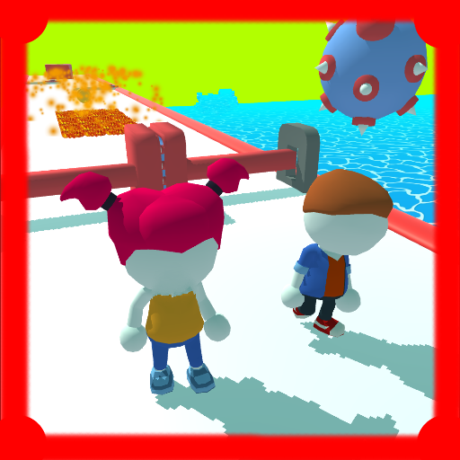

<p align="center"></p>
<h1 align="center">Love Runner 3D</h1>

## Description
<b>EN:</b>

Control a couple in love in a magical 3D world and pass through obstacles
Using this **API** key occurs in the following lines:


Link to [**YouTube**](https://youtu.be/iJ9wqMWMbeo?si=ukxkrNO4d0YSkTnf).

<b>UA:</b>

Управляйте закоханою парою в чарівному 3Д світі , та проходіть через перешкоди
                             

Посилання на  [**YouTube**](https://youtu.be/iJ9wqMWMbeo?si=ukxkrNO4d0YSkTnf).

#
## Screenshots
<p align="center">
  
  
  
  
  
  
  
  
</p>

#
## Technologies used
<b>EN:</b>
- Creating an application using the **Unity**
- Using the 3D Models
- Using the third-party service for analytics(***GameAnalytics***)
- Working with the local save (**PlayerPrefs**)
- Working on Iphone, Ipad, Android
- Using the elementary UI
- Image optimed textures
- Working with the **JSON** format
- Using a Di Container (**Zenject**)
- Created own application update system
- Optimized 3d Graph

<b>UA:</b>
- Створення програми за допомогою **Unity**
- Використання 3D моделей
- Використання стороннього сервісу для аналітики (***GameAnalytics***)
- Робота з локальним збереженням (**PlayerPrefs**)
- Працюю на Iphone, Ipad, Android
- Використання елементарного інтерфейсу користувача
— Оптимізовані текстури зображення
- Робота з форматом **JSON**
- Використання контейнера Di (**Zenject**)
- Створено власну систему оновлення додатків
— Оптимізований тривимірний графікa

#
## License
```
© 2021, CoolOtaku (ericspz531@gmail.com)
```
